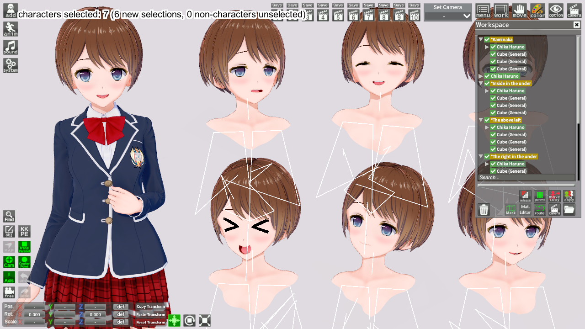

# StudioMultiselectChara

If you select a character in studio and press the hotkey, all other instances of that character in the scene will also be selected. Useful for replacing all instances of a given character.

## Supported Games

|                         | Game  | Studio  | Download     |
| ----------------------: | :---: | :-----: | ------------ |
| Koikatu/Koikatsu Party  | ❌    | ✔️      | [KK_StudioMultiselectChara]  |
| AI-Shoujo/AI-Syoujyo    | ❌    | ✔️      | [AI_StudioMultiselectChara]  |
| Honey Select 2          | ❌    | ✔️      | [HS2_StudioMultiselectChara] |

## Technical Info

### Dependencies

- [GeBoCommon](https://github.com/GeBo1/GeBoPlugins)
- [Illusion Modding API](https://github.com/IllusionMods/IllusionModdingAPI) v1.20.3+
- [BepInEx](https://github.com/BepInEx/BepInEx) v5.4.8+

## Example

Select a character in the tree:

Hit the hotkey (defaults to `Shift-Tab`) and all instances of the same character in the scene will be selected:

Now you can quickly apply changes to all selected characters (like Replace Character):

[//]: # (## Latest Links)

[AI_StudioMultiselectChara]: https://github.com/GeBo1/GeBoPlugins/releases/download/r33/AI_StudioMultiselectChara.v1.0.0.2.zip "v1.0.0.2"
[HS2_StudioMultiselectChara]: https://github.com/GeBo1/GeBoPlugins/releases/download/r33/HS2_StudioMultiselectChara.v1.0.0.2.zip "v1.0.0.2"
[KK_StudioMultiselectChara]: https://github.com/GeBo1/GeBoPlugins/releases/download/r33/KK_StudioMultiselectChara.v1.0.0.2.zip "v1.0.0.2"

