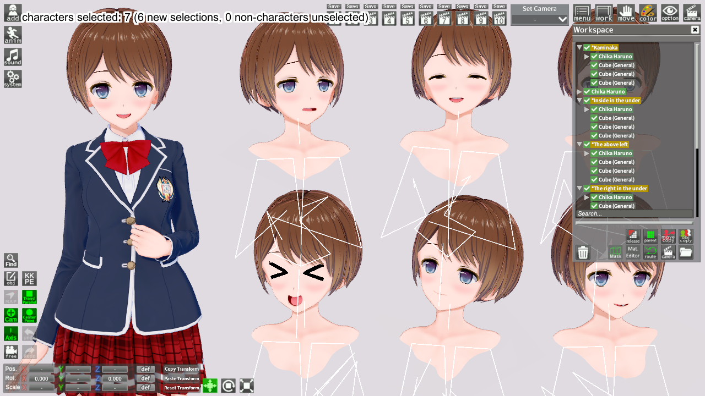
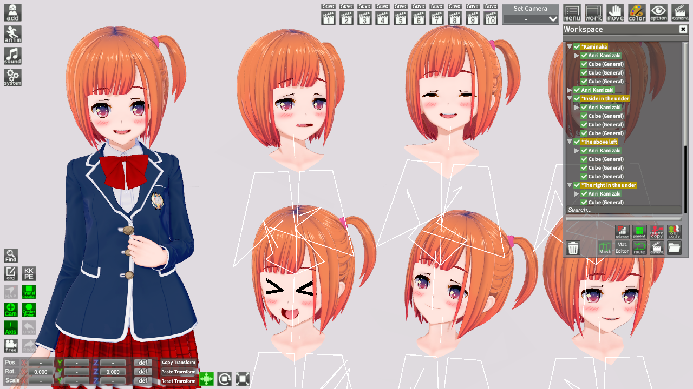

# StudioMultiselectChara

If you select a character in studio and press the hotkey, all other instances of that character in the scene will also be selected. Useful for replacing all instances of a given character.

## Technical Info

### Supported Games

|                        | Game               | Studio             |
| ----------------------:| ------------------ | ------------------ |
| Koikatu/Koikatsu Party | :x:                | :heavy_check_mark: |
| AI-Shoujo/AI-Syoujyo   | :x:                | :heavy_check_mark: |
| Honey Select 2         | :x:                | :heavy_check_mark: |

### Dependencies

- [GeBoCommon](https://github.com/GeBo1/GeBoPlugins)
- [Illusion Modding API](https://github.com/IllusionMods/IllusionModdingAPI) v1.12.3+
- [BepInEx](https://github.com/BepInEx/BepInEx) v5.1+

## Example

Select a character in the tree:

Hit the hotkey (defaults to `Shift-Tab`) and all instances of the same character in the scene will be selected:

Now you can quickly apply changes to all selected characters (like Replace Character):

